# Maquette

🇫🇷 [Version française](README.fr.md)

**A living floor plan for Home Assistant.**

Maquette is a Lovelace custom card that shows your home from above, live: lights glowing in their rooms,
open windows in red, shutters at their real position, every room tinted by its temperature, power flowing
to the devices that use it. You draw the plan right inside your dashboard with a built-in, CAD-like editor —
no floor-plan image to prepare, no external tool.

> **The first release (0.1.0) is being finalised: the code will be published in this repository very soon.**
> Interface in English and French (follows your Home Assistant profile language).

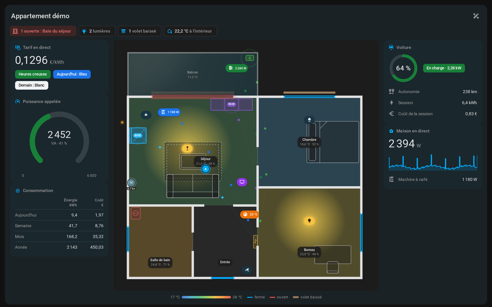

## Features

- **Live plan** — light halos clipped to their room, doors / windows / gates red when open, shutters drawn by
  position and animated while moving, rooms tinted by temperature with humidity in the label, connected
  furniture (EV charger, fridge, TV, electrical panel…) showing its power.
- **Cards on tap** — any piece of furniture, badge or opening can open its own card built from widgets
  (EV, cover / gate control with confirmation, charts, counters), filled automatically from the device.
- **Room view** — tap a room to zoom in: automatic buttons (all off, shutters), your own buttons, scenes,
  devices with toggles and linked automations.
- **Summary chips, badges and info boxes** — customizable chips above the plan (any entity, alert rules),
  badges on the plan and boxes of live values.
- **Side panels** — live tariff (Tempo colours), EV, gauge, 24 h chart tile, thermostat, room climate,
  day / week / month / year tables from Home Assistant long-term statistics.
- **Ambience** — optional and discreet by default: day / night from `sun.sun` with light from the sun's real side,
  real Home Assistant weather on outdoor areas (clouds, rain, snow, hail, fog, lightning, wind), fading traces of
  what just changed, animated energy flows, people at home or away in their real direction.
- **Full-plan alerts** — smoke, leak, opening while nobody is home, freezer too warm: pulsing veil, banner,
  elements circled.
- **Replay of the day** — the whole plan, panels included, redrawn at any moment of the last 1–72 hours, with a
  timeline, speeds from ×60 to ×3600 and marks for openings, lights and arrivals.
- **Built-in editor** (admins only) — walls, fences, openings, rooms and sub-areas, 45 top-view furniture symbols,
  layers, groups, snapping, multi-selection, undo / redo, Home Assistant area import with their devices,
  templates, YAML / JSON export and import; saves straight into the dashboard configuration.
- **⚙ Settings panel** — every card-wide option in one place (language, display, people, badges, interaction,
  wall tablet mode, animation level…).
- **Built-in demo** — a simulated apartment where everything works and nothing reaches your home
  (`demo: true`, or the « Maquette — demo » card and dashboard).
- **Material Design 3**, light and dark themes, phone and desktop (full page without scrollbars on desktop,
  bottom sheets and pinch-to-zoom on phones).

## Simple to set up: draw your home in the card

No floor-plan image to prepare, no external tool, no YAML to write: everything happens in the built-in editor,
right on your dashboard (click the ruler icon at the top of the card).

**1. Start from your Home Assistant areas.** On an empty plan, *Start with my areas* creates one room per area,
with its devices ready to place. You can also draw a room yourself or import an existing plan.

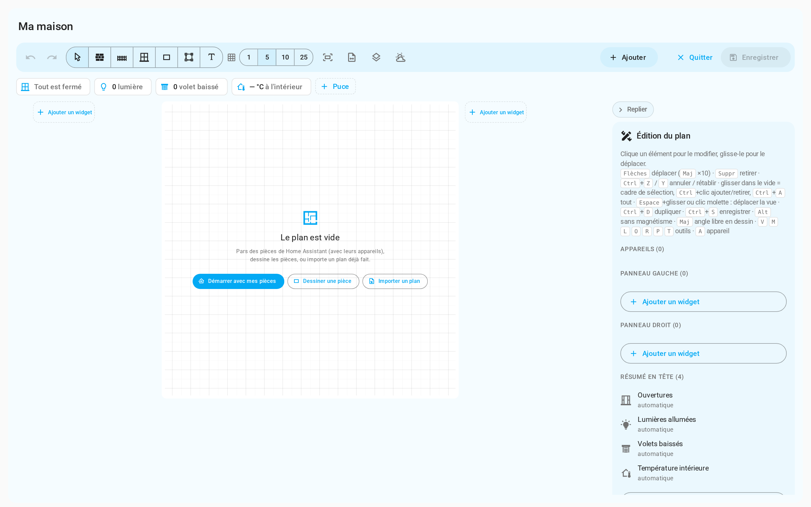

**2. Draw the rooms.** The rectangle tool draws a room with its walls in one move; type the width × height in
centimetres for an exact size. Shared walls stay shared when you resize a room, and everything snaps to the grid.

**3. Place doors, windows and shutters.** The room panel lists the openings of that area that are not on the plan
yet: one click, then click the wall where it goes.

**4. Furnish.** Drag one of the 45 top-view symbols from the catalogue (sofas, beds, kitchen, EV charger, car…);
furniture snaps to the walls and resizes from its corners. Link a piece of furniture to a device and its card is
filled automatically from that device.

| Catalogue | Drag, snap, resize |
|---|---|
| 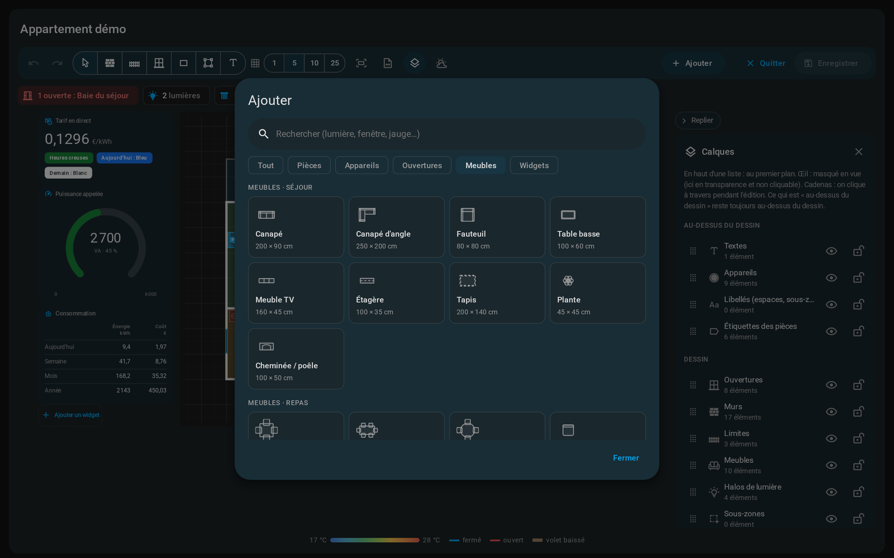 | 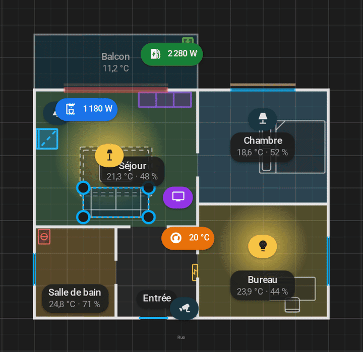 |

**5. Save.** The plan is stored in your dashboard configuration like any other card. Undo / redo, groups, layers,
multi-selection and YAML / JSON export are there when you need them.

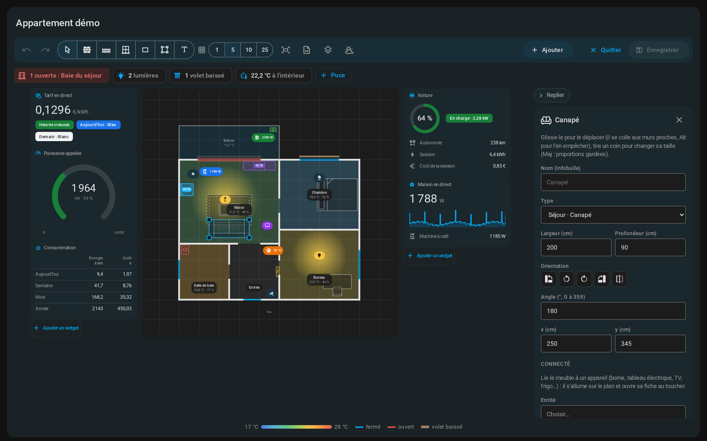

> Screenshots are taken from the built-in demo apartment (French interface; the card also speaks English).

## Screenshots

| Ambience | Replay | Editor |
|---|---|---|
| 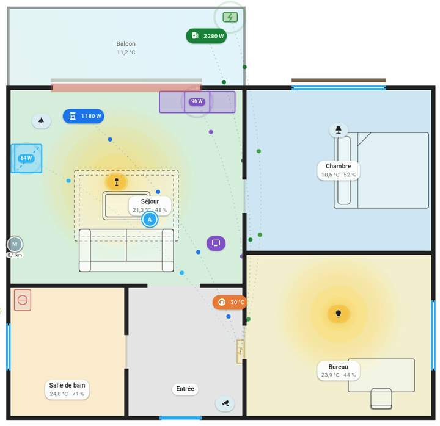 | 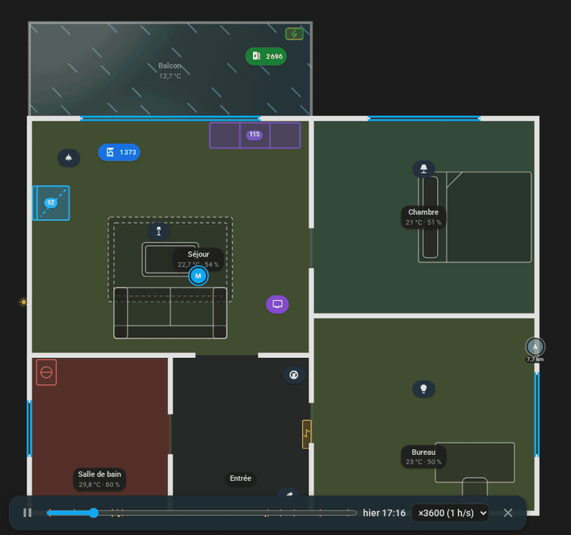 |  |

| Card on tap | Room view | Full-plan alert |
|---|---|---|
| 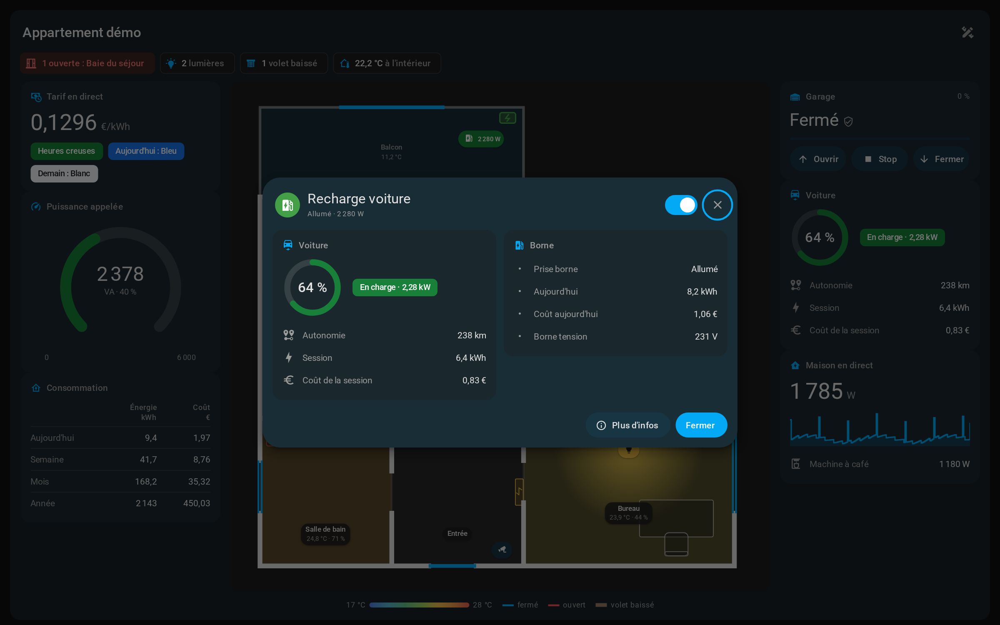 | 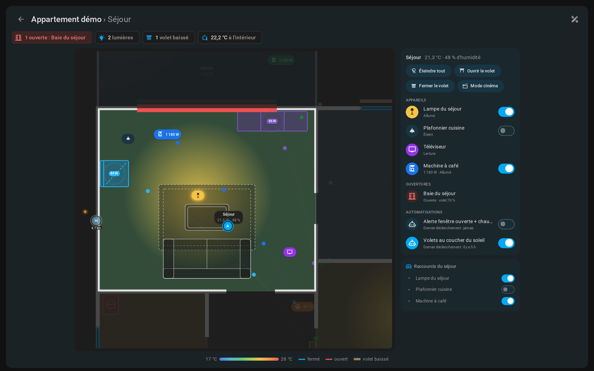 | 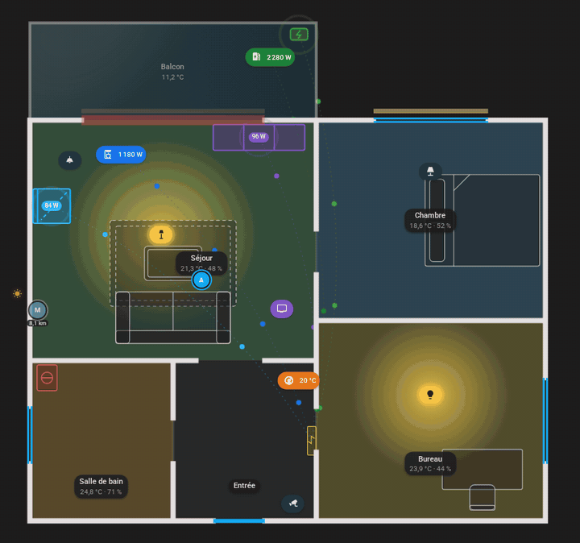 |

| Weather | Energy flows | Phone (light / dark) |
|---|---|---|
| 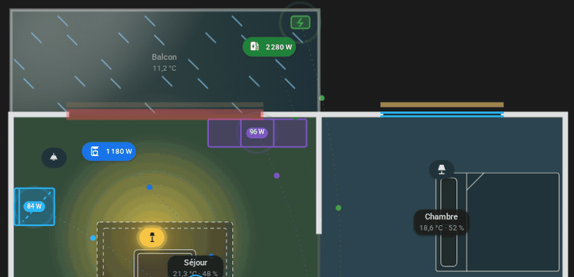 | 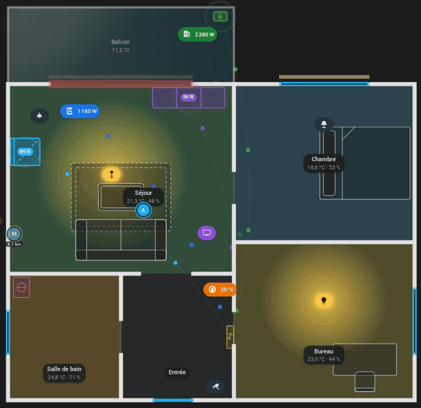 | 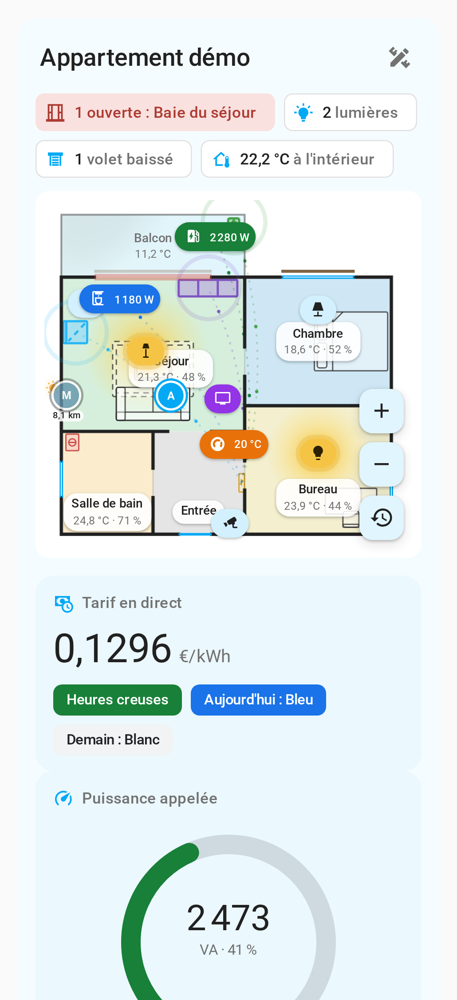 |

## Installation

### HACS (custom repository)

1. HACS → ⋮ → **Custom repositories** → add `https://github.com/TooMuhtsh/maquette-card`, category **Dashboard**.
2. Install **Maquette**, then reload your browser.

### Manual

1. Copy `dist/maquette-card.js` to `/config/www/maquette-card.js`.
2. Settings → Dashboards → ⋮ → **Resources** → add `/local/maquette-card.js` as a **JavaScript module**.

## Getting started

Create a new **Maquette** dashboard (blank) or **Maquette — demo**, or add the card —
it works best alone in a **panel** view:

```yaml
type: custom:maquette-card
title: My home
```

Then click the ruler icon at the top right of the card and draw, or start from your Home Assistant areas.
Every element and key is documented in the [configuration reference](docs/reference.md), also on the [wiki](https://github.com/TooMuhtsh/maquette-card/wiki).

## Status

Young project, under active development (first release 0.1.0 coming soon). Feedback and bug reports are welcome.
Roadmap: visual editor in the standard Lovelace card editor, background image (scanned plan) under the drawing.

## Built with Claude Code

Maquette is developed with [Claude Code](https://claude.com/claude-code), Anthropic's AI coding assistant:
the code is written with Claude Code under the author's direction, and every feature is tested on a real home.

## License

[MIT](LICENSE).
